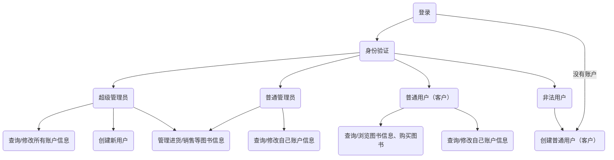
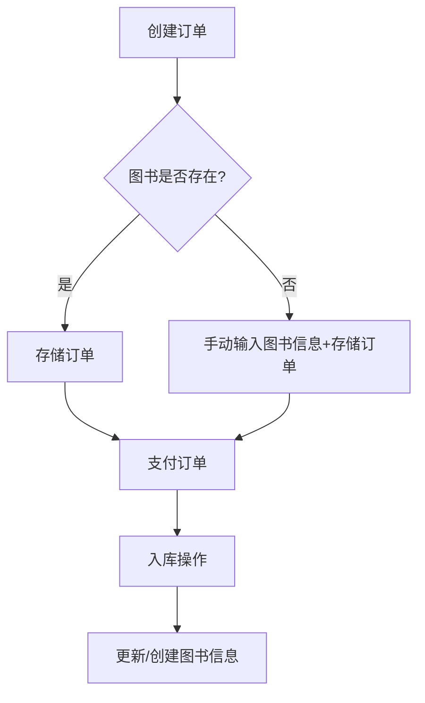
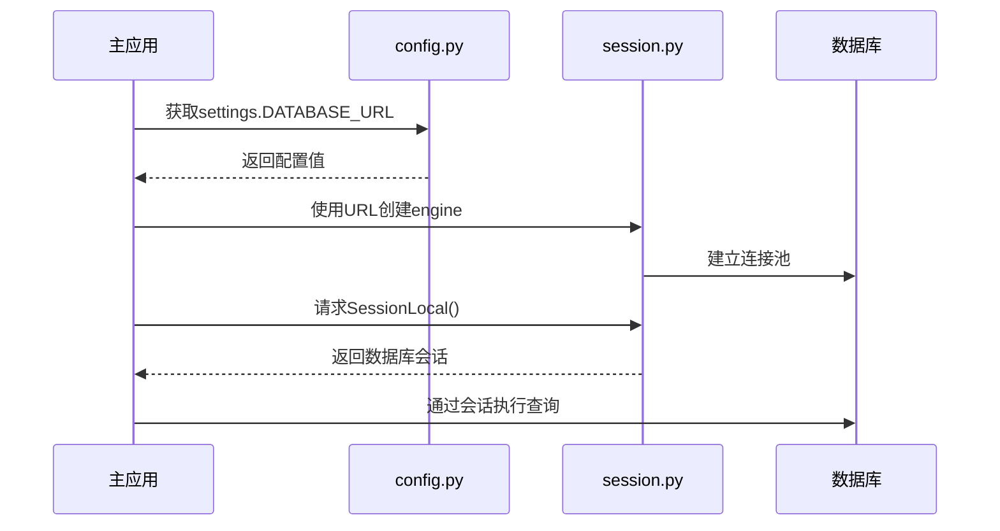

# 实验名称：中期实验

姓名：

学号：

实验题目：图书销售管理系统的设计与实现

实验背景：某书城需要一套图书管理系统对图书的进货、销售、财务等方面进行统一管理。

## 数据库设计

### 1、用户信息表

包括用户名，密码（存储密码哈希值），真实姓名，工号，性别， 年龄，用户邮箱，用户角色（super_admin、admin、user），账号状态，账号创建时间。

其中primary key为工号（id）。

### 2、图书信息表

包括书籍id，ISBN号，书名，作者，出版社，零售价格，当前库存数量，图书信息更新时间。

其中primary key为书籍id，为title建立index方便搜索。

### 3、进货清单表

包括进货单号，书籍id(foreign key from Books.id)，ISBN号，书名，作者，出版社，进货价格，购买数量，书籍状态（未付款/已退货/已付款，默认未付款），是否已入库，进货下单日期。

其中primary key为进货单号（id）。为了加快访问速度，现实情况进货清单可能会相当多，不适合查看的时候再进行连接，因此部分属性使用了冗余存储，详见具体代码`./backend/database/models/...`。

### 4、账单记录表

包括账单号，账单类别（purchase: 进货付款/ sale: 客户购买书籍），支出/收入数额，账单产生时间，书籍id(foreign key from Books.id)，ISBN号，书名，作者，出版社，进货/出售价格和进货/客户购买数量、用户id（普通用户购买图书时记录普通用户id，管理员用户支付账单时记录管理员id，foreign key from Users.id）

其中primary key为账单号（id），且建立index加快访问。为了加快访问速度，现实情况账单记录可能会相当多，不适合查看的时候再进行连接，因此部分属性使用了冗余存储，详见具体代码`./backend/database/models/...`。


## 系统功能设计

对于设计思路，我首先设计好了系统功能，同时设计数据库的各项表，然后确定使用的框架，最后根据设计编写文件，并不断丰富系统功能，最后优化系统界面。以下可以看到详细情况。

### 1、系统功能流程框图



首先进入登录界面，登录界面中可以输入用户名和密码以登录账户，也可以点击注册账号进入注册界面，使用用户名、邮箱、密码创建普通用户(user)。

登录后进入应用主界面。

- 普通用户可以从应用主界面进入图书信息界面，搜索图书/查看图书列表，点击某个图书的“购买”按钮可以进入图书销售页面，输入购买量购买图书；还可以进入个人信息界面，编辑个人信息。
- 普通管理员用户admin，除了上述功能外，点击某个图书的“编辑”按钮，更新书籍的信息；还可以在应用主界面点击“进货订单管理”进入进货管理界面，或者点击”账单记录“进入财务管理界面，进行相应操作。进货管理界面可以操作订单的支付、退款、图书入库。
- 超级管理员super_admin除了上述权限外，可以从主界面进入“用户管理”界面，查看所有用户信息或者通过用户ID/用户名搜索用户，并且点击对应用户旁的“更新”可以更改用户信息，点击“激活/失效”可以激活/封禁用户。

### 2、系统功能

普通用户（user）：

- 能创建普通用户账号（填写用户名、邮箱、密码），登录自身账号
- 登录后，能使用书籍id、isbn号、书名、作者、出版社查询书籍、购买书籍。
- 登录后能够查询、修改自身信息，包括用户名，密码（不能查询，但可修改），真实姓名，性别， 年龄，用户邮箱。


系统用户：

普通管理员用户（admin）：

- 能够登录自身账号，登录后能够查询、修改自身信息，包括用户名，密码，真实姓名，性别， 年龄，用户邮箱。

- 能对图书进货（包括新建/查询进货订单、进货订单付款、对未付款的订单退货，对于需要进货的书籍，如果库存中曾经有这本书的信息的话，则直接将该书籍的信息列入进货清单，否则显示需要手动输入进货书籍的相关信息，包括ISBN号，书名，作者，出版社等。此外，每种书都要指定其进货价格和购买数量。 对于刚列入进货清单的书籍给予未付款状态。）信息进行管理。




- 能对图书销售（包括对已付款的书籍添加到库存中（即图书信息表中），此时需要添加上书籍的零售价格）信息进行管理。
- 能按照时间段查看某一段时间内的财务信息（即账单记录表）。
- 能够修改图书信息，包括书籍名称、作者、出版社、零售价格等。

超级管理员用户（super_admin）：

- 拥有普通管理员用户（admin）的所有能力。
- 还能创建新的普通管理员用户（admin）和查看和修改所有用户的资料，修改用户账号状态。


账单记录表：

每当发生进货付款或者普通用户购买书籍时，自动产生一条支出或收入记录。管理员可以设置起始日期和结束日期，查看一段时间内的收入或支出记录。


## 项目目录

后端：python、fastapi（ ASGI 服务器使用 Uvicorn ）、sqlalchemy、SQLite

前端：React + Axios（对接后端 API）架构

我采用如上框架设计一个web应用，项目目录如下，部分文件夹内容省略：

```
BookManager/
├── backend/
│   ├── database/
│   │   ├── models/
│   │   │   ├── __init__.py  # 集中导出所有模型类，方便其他地方统一导入
│   │   │   ├── user.py		 # 用户模型
│   │   │   ├── book.py		 # 图书信息模型
│   │   │   ├── bill_record.py	 # 账单记录模型
│   │   │   └── purchase_order.py	 # 进货清单模型
│   │   ├── __init__.py      # 导出数据库核心组件，作为包入口
│   │   ├── session.py		 # 会话管理
│   │   ├── init_db.py		 # 数据库初始化程序
│   │   └── library.db       # SQLite数据库文件
│   ├── schemas/             # Pydantic模型
│   ├── crud/                # 数据库操作
│   ├── api/                 # 路由
│   ├── config.py            # 配置
│   ├── main.py              # 主入口
│   └── requirements.txt
├── frontend/
│   ├── src/
│   │   ├── style/				 # css文件
│   │   ├── api/
│   │   │   ├── api.js           # 全局axios配置
│   │   │   ├── auth.js          # 认证接口（登录、注册等）
│   │   │   ├── users.js         # 用户管理相关接口（创建管理员用户、查询修改用户信息等）
│   │   │   ├── books.js         # 图书相关接口（搜索、添加、更新等）
│   │   │   ├── bills.js         # 财务管理相关接口（查看财务记录等）
│   │   │   ├── orders.js        # 进货订单相关接口（创建、支付、入库等）
│   │   │   └── sales.js         # 销售相关接口（销售图书）
│   │   ├── components/          # 可复用组件
│   │   │   ├── BookCard.js      # 单个图书卡片展示
│   │   │   ├── OrderForm.js     # 订单表单组件
│   │   │   └── PrivateRoute.js  # 用于保护需要认证的页面
│   │   ├── pages/
│   │   │   ├── Login.js         # 登录页
│   │   │   ├── Register.js      # 注册页
│   │   │   ├── Home.js          # 首页
│   │   │   ├── Books/
│   │   │   │   ├── List.js      # 图书列表页
│   │   │   │   └── Edit.js      # 编辑图书页面（管理员）
│   │   │   ├── Orders/
│   │   │   │   ├── List.js      # 订单列表页（管理员）
│   │   │   │   ├── New.js       # 新建订单页面（管理员）
│   │   │   │   └── Stock.js     # 入库操作页面（管理员）
│   │   │   ├── Bills/
│   │   │   │   └── List.js      # 财务记录列表页
│   │   │   ├── Sales/
│   │   │   │   └── Sale.js      # 图书购买页
│   │   │   ├── Users/
│   │   │   │   ├── List.js      # 用户列表页（超级管理员）
│   │   │   │   ├── CreateAdmin.js      # 创建普通管理员页（超级管理员）
│   │   │   │   └── Edit.js      # 编辑用户信息页面（超级管理员）
│   │   │   └── Profile.js       # 个人信息页
│   │   ├── App.js               # 主路由配置
│   │   └── index.js              # 应用入口
│   ├── package.json
│   ├── package-lock.json
│   └── public/
│       └── index.html
├── scripts/
│   ├── run.bat
│   ├── setup.bat
│   └── stop.bat
├── venv/				 	 # 虚拟环境
└── README.md
```





## 创新点

1、赋予了超级管理员控制普通用户账号状态的能力，便于管理用户账号，当暂时不使用账号时可以停用账号，而非直接删除账号。

用户表中加入了一列：

```python
is_active = Column(Boolean, default=True) # True：表示账户状态正常；False：表示账户已被停用/禁用，无法登录
```

除此外，超级管理员还可以修改其他用户的账号信息。


2、使用更为安全的加密方式**bcrypt**，而非使用**MD5**进行加密。


3、访客可以注册普通用户账号，减少超级管理员的工作量，符合现实需求。


4、增加了图书信息表、用户信息表信息更新时间的属性，方便检查更新情况。


5、通过书籍编号、书籍ISBN号、书名、作者、出版社 查询书籍，不需要输入完整的信息，只需要输入keyword就可以查询，提升查询效率。


6、采购订单列表支持仅显示未付款订单，方便进行付款，符合现实需求。